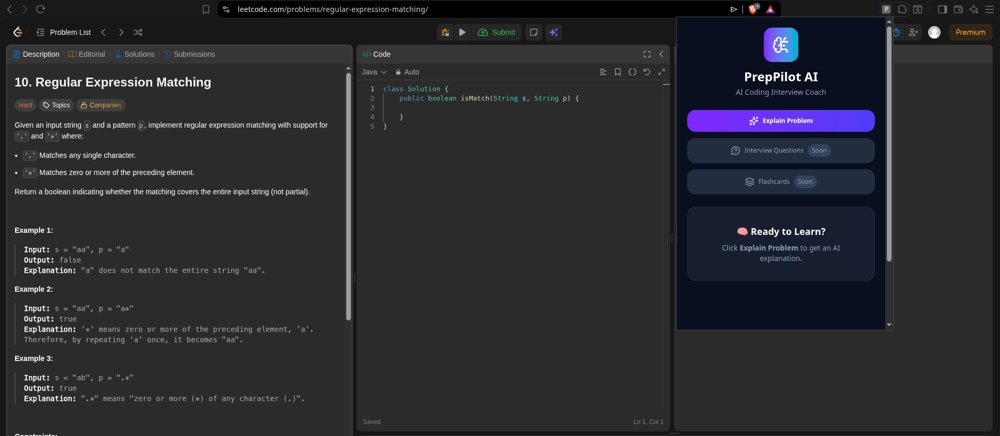
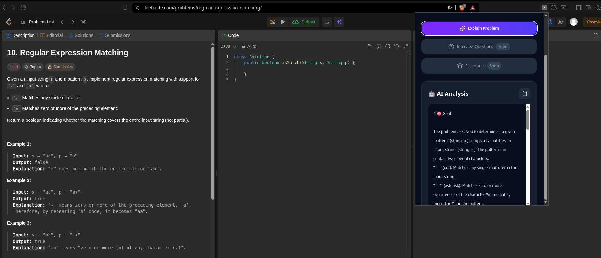
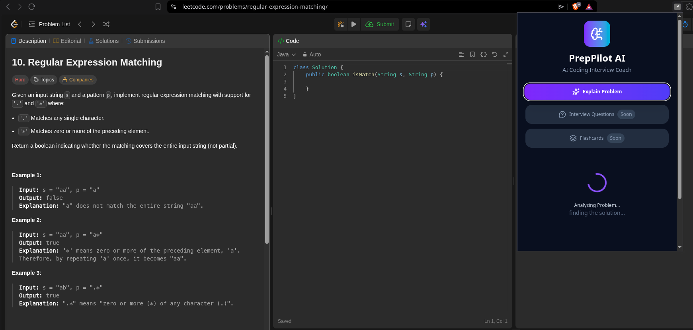

#  PrepPilot AI

AI-powered Chrome Extension that explains LeetCode problems in beginner-friendly language using Google Gemini.


---

## Overview

PrepPilot AI is a Chrome Extension that acts as an AI coding mentor.

Instead of switching between tabs or searching for explanations online, users can open the extension while solving a LeetCode problem and receive a beginner-friendly explanation generated by Google Gemini.

The extension automatically extracts the problem statement from the current LeetCode page and sends it to a deployed backend for AI analysis.

---

##  Features

*  AI-powered problem explanations
*  Automatically extracts LeetCode problem statements
*  Fast Gemini-powered responses
*  Copy explanation to clipboard
*  Modern React + Tailwind UI
*  Deployed backend using Render

### Coming Soon

* Interview Questions Generator
* Flashcards Generator

---

##  Architecture

LeetCode Page
⬇
Content Script
⬇
Chrome Message Passing
⬇
React Popup
⬇
Express Backend
⬇
Google Gemini API
⬇
AI Explanation

---

## Tech Stack

### Frontend

* React
* Tailwind CSS
* Chrome Extension API
* Vite

### Backend

* Node.js
* Express.js
* Google Gemini API

### Deployment

* Render

---

##  Installation

### Clone

```bash
git clone https://github.com/Bhawan-deep/PrepAi-ext
```

### Frontend

```bash
npm install
npm run build
```

Load the generated `dist` folder into Chrome using:

```
chrome://extensions
```

Enable **Developer Mode** → **Load unpacked** → Select the `dist` folder.

### Backend

```bash
cd backend
npm install
npm start
```


### Screenshots

### Home



### AI Analysis



### Loading



##  Project Structure

```
preppilot-ai/
│
├── backend/
├── src/
├── public/
├── package.json
└── README.md
```

---

## Future Improvements

* AI-generated Interview Questions
* AI Flashcards
* Difficulty-based learning paths
* Support for additional coding platforms
* Authentication and saved learning history

---

## Author

**Bhawandeep Singh**

If you found this project interesting, feel free to ⭐ the repository.
